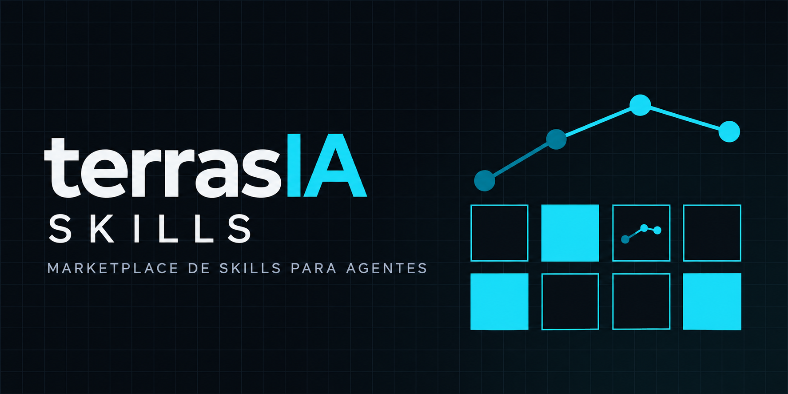

# TerrasIA Skills



**Skills de agente para o Claude Code** — escrita, LinkedIn, RH, financeiro, fiscal, vendas,
design, mídia e desenvolvimento. Cada skill é um plugin independente: instale só as que quiser.

[](LICENSE)


## Instalar

**No Claude Code**, pelo marketplace:

```bash
/plugin marketplace add Terras-IA/skills
/plugin install terras-linkedin@terras
```

Dentro do Claude Code, `/plugin` mostra o catálogo inteiro e instala o que você marcar. Depois,
para atualizar: `/plugin marketplace update terras`.

**No ZCode, no Codex (GPT) e no opencode**, por link simbólico, com o repositório como fonte:

```bash
git clone https://github.com/Terras-IA/skills.git ~/terras-skills
bash ~/terras-skills/scripts/instalar.sh --aplicar
```

O script cria um link por skill em cada pasta de agente que já existir na sua máquina
(`~/.zcode/skills`, `~/.codex/skills`, `~/.config/opencode/skills`, `~/.claude/skills`); pasta que
não existe não é criada. Como o link aponta para o repositório, `git -C ~/terras-skills pull`
atualiza tudo. Para instalar só algumas skills, copie a pasta `skills/<nome>/` para a pasta de
skills do agente.

## O que tem dentro

Um recorte por área — o catálogo completo está logo abaixo.

**Escrita e conteúdo** — `terras-linkedin`, `terras-humanizer`, `terras-substack`, `terras-ebook`, `terras-noticias`, `terras-paper-diario`.
Posts que soam humanos, newsletter publicada e agendada, e-book e audiolivro para vender, e boletins ou papers que viram resumo e post.

**People e RH** — `terras-gerador-de-pdi`, `terras-gerador-de-okrs-de-pessoas`, `terras-gerador-de-matriz-9-box`, `terras-gerador-de-plano-de-entrevista-estruturada`, `terras-analisador-de-pulse-semanal`, `terras-triagem-riscos-psicossociais`, `terras-screenador-de-curriculos-com-ia`, `terras-roteirizador-de-onboarding`, `terras-gestao-de-ferias-e-escalas`.
Da triagem e da entrevista ao PDI, aos OKRs e ao comunicado — com critério e evidência, sem dado sensível.

**Financeiro e fiscal** — `terras-conciliacao-bancaria-ofx`, `terras-conferencia-fechamento-folha`, `terras-conferencia-nfe-tomador-prestador`, `terras-apuracao-retencoes-federais`, `terras-fluxo-de-contas-a-pagar`, `terras-gestao-de-inadimplencia-cobranca`.
Conciliação bancária, fechamento de folha, conferência de nota e retenções: separa o que fecha do que precisa de decisão humana.

**Vendas e mercado** — `terras-qualificacao-icp-bant`, `terras-playbook-quebra-objecoes`, `terras-elaboracao-proposta-comercial`, `terras-analise-swot`, `terras-matriz-gut`, `terras-pauta-mercado`.
Qualificação de lead, resposta à objeção real, proposta, priorização com GUT e a análise mercado × TerrasIA em formato cobre/rejeita/falta.

**Design e UI** — `terras-design`, `terras-design-system`, `terras-brand`, `terras-brandkit`, `terras-ui-ux-pro-max`, `terras-image-to-code`, `terras-minimalist-ui`, `terras-industrial-brutalist-ui`.
Identidade, tokens, componentes e direção de arte — com o anti-genérico do design-taste.

**Mídia: áudio, vídeo e imagem** — `terras-audio`, `terras-video`, `terras-banner`, `terras-ffmpeg`, `terras-transcription`, `terras-slides`, `terras-visual-explainer`.
Narração com pronúncia cuidada, vídeo para YouTube e Shorts, banner, transcrição local sem API, slides e páginas que explicam visualmente.

**Desenvolvimento** — `terras-revisao-de-codigo`, `terras-security-review`, `terras-e2e-testing`, `terras-react-patterns`, `terras-postgres`, `terras-mcp-server`, `terras-database-migrations`, `terras-tech-debt`, `terras-standards`.
Revisão pelo risco que a mudança cria, segurança, testes ponta a ponta, banco, migrations e o padrão de engenharia da casa.

## O catálogo completo

<!-- catalogo:inicio -->
<!-- gerado por `npm run readme` a partir do catálogo — não edite à mão -->

**117 skills instaláveis** entre as 128 deste repositório; as demais ficam fora do marketplace — 8 skills de processo do motor (`.nao-instalar`) e 3 skills ligadas a projeto de cliente (`marketplace-fora.json`).

<details>
<summary><b>Ver a lista completa (117 skills)</b></summary>

| Skill | O que faz |
|---|---|
| [`terras-accessibility`](skills/terras-accessibility) | Projetar, implementar e auditar interface acessível no nível AA da WCAG 2.2 em Web, iOS e Android: papéis e rótulos ARIA, foco, contraste, tamanho de alvo e leitor… |
| [`terras-agenda-de-touchpoints`](skills/terras-agenda-de-touchpoints) | Estrutura 1:1s recorrentes com pautas, histórico de feedback, decisões e loops abertos. |
| [`terras-analisador-de-linguagem-inclusiva`](skills/terras-analisador-de-linguagem-inclusiva) | Revisa vagas, avaliações e comunicados em busca de linguagem enviesada, excludente ou pouco acessível. |
| [`terras-analisador-de-pulse-semanal`](skills/terras-analisador-de-pulse-semanal) | Processa respostas de pulse survey semanal e transforma temas recorrentes em insights acionáveis para lideranças. |
| [`terras-analise-swot`](skills/terras-analise-swot) | Faz análise SWOT rastreável e terminada em ação: cada item cita a fonte (dado, documento, métrica), o que não tem fonte vira hipótese marcada com o teste… |
| [`terras-animacao`](skills/terras-animacao) | Produz peça animada em loop a partir de uma cena HTML dirigida por tempo: o HTML determinístico (contrato ?t=), o render quadro a quadro no Chrome headless e a montagem… |
| [`terras-apuracao-retencoes-federais`](skills/terras-apuracao-retencoes-federais) | Confere se as retenções federais na fonte de uma nota de serviço foram aplicadas, dispensadas ou esquecidas, usando as alíquotas e limites informados pela empresa, nunca… |
| [`terras-astro`](skills/terras-astro) | Publica site estático multilíngue de graça no Cloudflare Pages com Astro e conteúdo em markdown. |
| [`terras-audio`](skills/terras-audio) | Voz, pronúncia e cadeia de áudio para narração: vídeo, audiolivro comum e técnico, nota de voz, capítulo. · Instale com o plugin `terras-midia`. |
| [`terras-azure-devops`](skills/terras-azure-devops) | List Azure DevOps projects, repositories, and branches; create pull requests; manage work items; check build status. |
| [`terras-banner`](skills/terras-banner) | Cria a imagem que acompanha um post, newsletter ou nota: banner 1200x628 para LinkedIn e og:image da Substack, card em pé 1080x1350, capa. · Instale com o plugin `terras-midia`. |
| [`terras-banner-design`](skills/terras-banner-design) | Banners para redes sociais, anúncios, heros de site e impressão: 22 estilos de direção de arte, tamanhos por plataforma, com visuais gerados ou fornecidos. |
| [`terras-bar-raiser-de-cultura`](skills/terras-bar-raiser-de-cultura) | Estrutura entrevistas de fit cultural com critérios observáveis, scoring e recomendação; use em processos seletivos que exigem avaliação consistente de valores. |
| [`terras-brand`](skills/terras-brand) | Marca: voz e tom, identidade visual, frameworks de mensagem, paleta e tipografia, organização/validação de ativos e auditoria de consistência; sincroniza as diretrizes… |
| [`terras-brandkit`](skills/terras-brandkit) | Gera a imagem do brand kit de uma marca: quadro de identidade visual com direção de logo, paleta, tipografia, aplicações em mockup e apresentação para cliente. |
| [`terras-briefing-pre-reuniao-de-lideranca`](skills/terras-briefing-pre-reuniao-de-lideranca) | Prepara briefings para líderes com saúde do time, feedbacks recentes, loops abertos, riscos e perguntas para a reunião. |
| [`terras-canal-whatsapp`](skills/terras-canal-whatsapp) | Publica texto e/ou imagem no canal (newsletter) do WhatsApp pela sessão pareada do sidecar, com pré-checagem de papel e confirmação explícita. |
| [`terras-care-to-dare-coach`](skills/terras-care-to-dare-coach) | Gera prompts de coaching, scripts de feedback e planos de desafio com base no framework Care to Dare. |
| [`terras-comentarios`](skills/terras-comentarios) | Comenta em lote posts do LinkedIn de terceiros: o usuário manda uma lista de posts colados, a skill lê cada texto e devolve um comentário curto de até 100 caracteres… |
| [`terras-conciliacao-bancaria-ofx`](skills/terras-conciliacao-bancaria-ofx) | Concilia extrato bancário com os lançamentos internos e separa o que casou, o que divergiu, o que é tarifa e o que ficou sem par. |
| [`terras-conferencia-fechamento-folha`](skills/terras-conferencia-fechamento-folha) | Confere o fechamento da folha antes do envio — horas extras, adicional noturno, faltas e encargos — apontando o que não fecha por matrícula, sem afirmar alíquota nem… |
| [`terras-conferencia-nfe-tomador-prestador`](skills/terras-conferencia-nfe-tomador-prestador) | Confere uma nota fiscal recebida ou emitida campo a campo e separa o que está consistente do que precisa de decisão humana, sem afirmar alíquota nem enquadramento… |
| [`terras-consolidacao-de-memoria`](skills/terras-consolidacao-de-memoria) | Mantém a memória de um repositório pequena e verdadeira: ao fechar uma spec, registra o que foi entregue e funde os requisitos num doc por domínio; compacta o histórico… |
| [`terras-construtor-de-job-description`](skills/terras-construtor-de-job-description) | Gera descrições de cargo claras, inclusivas e alinhadas à cultura e ao modelo de competências da organização. |
| [`terras-cover-letter`](skills/terras-cover-letter) | Escreve e revisa cartas de apresentação (cover letters) para vagas internacionais e remotas. |
| [`terras-critica-de-spec`](skills/terras-critica-de-spec) | Critica uma spec antes da implementação (critério de aceite que não dá para testar, caso de borda faltando, escopo ambíguo, contradição, regra do repositório violada)… |
| [`terras-dashboard-de-utilizacao-de-beneficios`](skills/terras-dashboard-de-utilizacao-de-beneficios) | Analisa adesão, utilização, custo e satisfação dos benefícios por tipo de saldo, período e público permitido. |
| [`terras-database-migrations`](skills/terras-database-migrations) | Migrations de banco seguras e reversíveis: mudanças só para frente em produção, expand-contract para renomear sem downtime, índices concorrentes, backfill em lotes,… |
| [`terras-decisor`](skills/terras-decisor) | Use para tomar decisões estruturadas a partir de um contexto, retornando exclusivamente um YAML válido. |
| [`terras-deep-research`](skills/terras-deep-research) | Pesquisa em profundidade com rastreamento de citações: pipeline de 3 a 8 fases (escopo, plano, recuperação, triangulação, síntese, crítica, refinamento e empacotamento)… |
| [`terras-design`](skills/terras-design) | Skill guarda-chuva de design: identidade de marca, tokens, UI, geração de logo com IA, programa de identidade corporativa (CIP, 50 entregáveis), apresentações HTML… |
| [`terras-design-system`](skills/terras-design-system) | Arquitetura de design tokens em três camadas (primitivo, semântico, componente), especificações de componentes e estados, variáveis CSS, escalas… |
| [`terras-design-taste-frontend`](skills/terras-design-taste-frontend) | Anti-slop de frontend para landing pages, portfólios e redesigns: lê o briefing, infere a direção de design e entrega interface que não parece template, com design… |
| [`terras-design-taste-frontend-v1`](skills/terras-design-taste-frontend-v1) | Versão 1 legada do design-taste-frontend (a v2 é a padrão da casa). Preservada para projetos que dependem do comportamento exato da v1. |
| [`terras-e2e-testing`](skills/terras-e2e-testing) | Testes end-to-end com Playwright: Page Object Model, configuração, integração com CI, artefatos (trace, vídeo, screenshot) e estratégia para teste instável. |
| [`terras-ebook`](skills/terras-ebook) | Cria e-book e audiolivro para vender: estrutura, diagramação, EPUB e PDF A5 diagramado como livro, capa, ISBN, escolha de plataforma, royalties, preço e lançamento —… |
| [`terras-educacao-corporativa`](skills/terras-educacao-corporativa) | Aplica 26 prompts de educação corporativa (derivados do ebook da Alun Business) para gerar estratégia de T&D, diagnóstico de necessidades, mapa de competências, trilhas… |
| [`terras-elaboracao-proposta-comercial`](skills/terras-elaboracao-proposta-comercial) | Estrutura a minuta de uma proposta a partir do que foi levantado na conversa, separando escopo de expectativa e marcando cada número que ainda precisa de confirmação… |
| [`terras-eval-harness`](skills/terras-eval-harness) | Desenvolvimento guiado por eval para trabalho com agentes e prompts: definir evals de capacidade e de regressão antes de codar, corrigir por código, modelo, regra… |
| [`terras-excalidraw`](skills/terras-excalidraw) | Use quando o pedido for um desenho Excalidraw, diagrama editável, esboço à mão, quadro branco, wireframe rascunho, ou imagem de diagrama (PNG/SVG) para post, slide… |
| [`terras-ffmpeg`](skills/terras-ffmpeg) | Edita vídeo e áudio com FFmpeg local a partir de pedidos em linguagem natural: cortar, aparar, juntar, redimensionar (9:16, 1:1), acelerar, legendas (SRT/ASS, animadas… |
| [`terras-fluxo-de-contas-a-pagar`](skills/terras-fluxo-de-contas-a-pagar) | Leva uma conta a pagar da chegada do documento até a liberação: autenticidade do boleto, alçada por valor e escalonamento. |
| [`terras-frontend-slides`](skills/terras-frontend-slides) | Cria apresentações HTML ricas em animação, sem dependência nenhuma, do zero ou convertendo PowerPoint. |
| [`terras-full-output-enforcement`](skills/terras-full-output-enforcement) | Força saída completa em qualquer tarefa: proíbe truncamento, placeholders e abreviações tipo 'resto igual', e trata quebra por limite de token. |
| [`terras-gerador-de-all-hands`](skills/terras-gerador-de-all-hands) | Prepara o encontro mensal de toda a empresa com resumo de resultados, perguntas votadas e talking points. |
| [`terras-gerador-de-comunicacao-de-rh`](skills/terras-gerador-de-comunicacao-de-rh) | Redige comunicados internos claros sobre políticas, mudanças organizacionais, benefícios e atualizações de People. |
| [`terras-gerador-de-matriz-9-box`](skills/terras-gerador-de-matriz-9-box) | Organiza performance e potencial em uma matriz 9-Box com critérios, evidências e planos de ação por quadrante. |
| [`terras-gerador-de-okrs-de-pessoas`](skills/terras-gerador-de-okrs-de-pessoas) | Cria OKRs trimestrais de People conectados à estratégia do negócio, com resultados mensuráveis e responsáveis. |
| [`terras-gerador-de-pdi`](skills/terras-gerador-de-pdi) | Cria planos de desenvolvimento individual conectando feedbacks, competências, ações, recursos e evidências de evolução. |
| [`terras-gerador-de-plano-de-entrevista-estruturada`](skills/terras-gerador-de-plano-de-entrevista-estruturada) | Cria roteiros por competência com perguntas comportamentais, sinais de evidência e rubrica de avaliação. |
| [`terras-gerador-de-politica-de-beneficios`](skills/terras-gerador-de-politica-de-beneficios) | Redige políticas de benefícios claras, aplicáveis e alinhadas ao PAT e ao orçamento informado pela empresa. |
| [`terras-gestao-de-ferias-e-escalas`](skills/terras-gestao-de-ferias-e-escalas) | Organiza períodos aquisitivo e concessivo, abono e fracionamento por equipe, e mostra onde a escala não se sustenta — com os prazos informados pela empresa, não… |
| [`terras-gestao-de-inadimplencia-cobranca`](skills/terras-gestao-de-inadimplencia-cobranca) | Monta a régua de cobrança de D-3 a D+15 com o tom de cada contato, os encargos do contrato e o ponto de decisão. |
| [`terras-governanca-padroes`](skills/terras-governanca-padroes) | Audita onde as convenções de um projeto vivem (CLAUDE.md, AGENTS.md, lint, CI, docs, cabeça do time) e transforma padrão em governance rule: arquivo Markdown versionado… |
| [`terras-gpt-taste`](skills/terras-gpt-taste) | Variante estrita do design-taste para GPT/Codex: variância de layout com randomização real, estrutura AIDA, bento sem buracos, GSAP (pinning, stacking, scrubbing)… |
| [`terras-high-end-visual-design`](skills/terras-high-end-visual-design) | Design visual de alto padrão: define fontes, espaçamento, sombras, cartões e animações que fazem o site parecer caro, e bloqueia os padrões que deixam design de IA… |
| [`terras-historias-infantis`](skills/terras-historias-infantis) | Cria histórias infantis ilustradas em quadrinhos e o LIVRO DE COLORIR da mesma história e das mesmas imagens — recebe um tema ou a história pronta, escreve o roteiro… |
| [`terras-humanizer`](skills/terras-humanizer) | Reescreve texto com cara de IA para soar humano, sem mudar o que ele diz e sem inventar nada. |
| [`terras-humanizer-dev`](skills/terras-humanizer-dev) | Reescreve ou revisa texto para soar natural e humano, preservando a voz, as opiniões e o ritmo do autor, sem deixar o texto errado ou informal demais. |
| [`terras-identidade`](skills/terras-identidade) | Le a identidade visual de uma marca a partir de imagens (pecas de anuncio, prints, manual, papelaria, site) e entrega ela pronta para reusar: cores com papel medido… |
| [`terras-image-to-code`](skills/terras-image-to-code) | Pipeline imagem-primeiro para site: gera a própria imagem de referência, analisa em detalhe e implementa o frontend fiel a ela, seção a seção, evitando sub-geração… |
| [`terras-imagegen-frontend-mobile`](skills/terras-imagegen-frontend-mobile) | Gera imagens de telas e fluxos de app mobile (iOS, Android, cross-platform) com mockup de celular, tipografia legível, paleta controlada e consistência entre telas. |
| [`terras-imagegen-frontend-web`](skills/terras-imagegen-frontend-web) | Gera as imagens de referência de um site — uma imagem horizontal por seção, nunca comprimidas — com variedade de composição, escala de hero, CTA e paleta única. |
| [`terras-industrial-brutalist-ui`](skills/terras-industrial-brutalist-ui) | Interface brutalista industrial: grade suíça rígida, tipografia mecânica com contraste extremo, paleta utilitária e degradação analógica (halftone, scanline, dither). |
| [`terras-laravel`](skills/terras-laravel) | Build robust Laravel apps avoiding Eloquent traps, queue failures, and auth pitfalls. |
| [`terras-last30days`](skills/terras-last30days) | Pesquisa o que se falou sobre um tema nos últimos 30 dias em Reddit, X, YouTube, Hacker News, Polymarket, GitHub e web, com motor local vendorizado. |
| [`terras-linkedin`](skills/terras-linkedin) | Ajuda a escrever posts para LinkedIn. |
| [`terras-linkedin-metricas`](skills/terras-linkedin-metricas) | Extrai, guarda e diagnostica as estatisticas dos posts do LinkedIn do Everton: impressoes, usuarios alcancados, divisao na rede e fora da rede, reacoes, comentarios… |
| [`terras-mapeamento-de-processos`](skills/terras-mapeamento-de-processos) | Mapeia um processo a partir de áudio, gravação de tela, transcrição ou relato falado e devolve o mapa visual (AS-IS e TO-BE), o diagnóstico com números e o plano… |
| [`terras-matriz-gut`](skills/terras-matriz-gut) | Prioriza problemas e demandas concorrentes com a matriz GUT: notas 1-5 ancoradas em Gravidade, Urgência e Tendência, score por produto, faixa de decisão declarada antes… |
| [`terras-mcp-server`](skills/terras-mcp-server) | Construção de servidor MCP com o SDK Node/TypeScript: tools, resources, prompts, validação com Zod e escolha de transporte (stdio ou Streamable HTTP). |
| [`terras-miniapp-builder`](skills/terras-miniapp-builder) | Cria um miniapp do zero — recebe o assunto, entrevista as lacunas, decide arquitetura e LGPD, escolhe e dosa a paleta, escreve a copy (promessa, objeções, crenças… |
| [`terras-minimalist-ui`](skills/terras-minimalist-ui) | UI minimalista editorial: paleta monocromática quente, hierarquia tipográfica, bento grid flat e pastéis discretos; sem gradientes nem sombras pesadas. |
| [`terras-noticias`](skills/terras-noticias) | Lê boletins e roundups de notícias (ratos de IA e afins), tria por criticidade e prioridade, resume todos os itens rápido e escreve o rascunho do post de digest… |
| [`terras-paper-diario`](skills/terras-paper-diario) | Lê papers (arXiv e afins) sobre estudos que afetam o trabalho de quem desenvolve — agentes de IA em PRs, qualidade de código gerado, produtividade, mercado de trabalho —… |
| [`terras-pauta-mercado`](skills/terras-pauta-mercado) | Transforma referência externa (repo, post, anúncio, paper) na análise mercado × TerrasIA com cobre/rejeita/falta e recibo, e no pacote de posts por canal (Company Page… |
| [`terras-people-dashboard-automatico`](skills/terras-people-dashboard-automatico) | Monta um dashboard mensal de liderança com headcount, retenção, remuneração, contratação e DEI. |
| [`terras-php`](skills/terras-php) | Write solid PHP avoiding type juggling traps, array quirks, and common security pitfalls. |
| [`terras-pipeline-de-automacao`](skills/terras-pipeline-de-automacao) | Projeta e monta pipelines de automação em que scripts determinísticos executam o trabalho e o agente decide só em pontos de revisão fechados. |
| [`terras-plano-tdd`](skills/terras-plano-tdd) | Transforma uma spec revisada em plano test-first (RED, GREEN, REFACTOR) com arquivo e nome de teste concretos, e uma lista de tarefas em que cada uma diz por comando… |
| [`terras-playbook-quebra-objecoes`](skills/terras-playbook-quebra-objecoes) | Classifica a objeção real por trás do que o cliente disse e devolve caminhos de resposta apoiados no que a empresa consegue sustentar, sem prometer preço, prazo… |
| [`terras-ponytail`](skills/terras-ponytail) | Lazy senior dev mode for any coding task (write, refactor, fix, review): YAGNI, stdlib first, no unrequested abstractions. Not for non-coding requests. |
| [`terras-postgres`](skills/terras-postgres) | Administra e otimiza banco PostgreSQL pelas tools do postgres-mcp: verificação de saúde, ajuste de índice, análise de plano de consulta, leitura de schema e execução… |
| [`terras-prompt`](skills/terras-prompt) | Use ao criar, revisar, avaliar ou ajustar um PROMPT (texto para IA), não para executar a tarefa descrita. |
| [`terras-qualificacao-icp-bant`](skills/terras-qualificacao-icp-bant) | Qualifica um lead a partir do que foi dito na conversa — orçamento, autoridade, necessidade e timing — separando o que o cliente afirmou do que o vendedor supôs,… |
| [`terras-react-patterns`](skills/terras-react-patterns) | Padrões de React 18/19: disciplina de hooks, fronteira entre server e client component, Suspense e error boundary, form actions, busca de dados, árvore de decisão… |
| [`terras-react-testing`](skills/terras-react-testing) | Testes de componente React com React Testing Library, Vitest ou Jest, MSW para simular rede, asserções de acessibilidade com axe, e quando usar teste de componente… |
| [`terras-redesign-existing-projects`](skills/terras-redesign-existing-projects) | Redesign de projeto existente: audita a UI atual, identifica padrões genéricos de IA e aplica padrão premium sem quebrar funcionalidade, em qualquer framework CSS ou CSS… |
| [`terras-reverse-engineer`](skills/terras-reverse-engineer) | Investiga como uma feature funciona em software empacotado (app Electron/JS, site, APK, binário nativo, .NET, firmware, HAR) com o REA por MCP ou CLI, cada conclusão… |
| [`terras-revisao-cruzada`](skills/terras-revisao-cruzada) | Manda uma spec ou um diff, em paralelo, para agentes de linha de comando de outros fornecedores (Codex, opencode) e junta os vereditos num revisao.md único,… |
| [`terras-revisao-de-codigo`](skills/terras-revisao-de-codigo) | Revisa uma mudança de código pelo risco que ela cria, com foco em integração que movimenta dinheiro ou dado de cliente: correção, idempotência, falha parcial, segredo… |
| [`terras-robo-de-atendimento-de-rh`](skills/terras-robo-de-atendimento-de-rh) | Estrutura um atendimento de auto serviço para dúvidas de férias, benefícios, políticas e folha, com encaminhamento seguro para casos complexos. |
| [`terras-roteirizador-de-onboarding`](skills/terras-roteirizador-de-onboarding) | Monta um plano de onboarding de 30, 60 e 90 dias com check-ins, tarefas e expectativas claras para a nova pessoa. |
| [`terras-screenador-de-curriculos-com-ia`](skills/terras-screenador-de-curriculos-com-ia) | Ranqueia currículos por requisitos da vaga e anonimiza dados sensíveis para apoiar uma triagem mais justa e auditável. |
| [`terras-security-review`](skills/terras-security-review) | Checklist e padrões de segurança para código: autenticação, entrada do usuário, segredos, endpoints de API, pagamento e dados sensíveis, com anexo de segurança… |
| [`terras-seed`](skills/terras-seed) | Use sempre que o pedido for sobre criar, revisar, avaliar ou ajustar um PROMPT (o texto de instrução dado a uma IA como ChatGPT, Claude ou Gemini), e não sobre executar… |
| [`terras-seo`](skills/terras-seo) | Auditar, planejar e implementar SEO: SEO técnico, otimização on-page, dados estruturados (schema.org), Core Web Vitals e estratégia de conteúdo. |
| [`terras-simulador-de-oferta`](skills/terras-simulador-de-oferta) | Simula propostas de remuneração considerando benchmark de mercado, equidade interna e cenários de negociação. |
| [`terras-skill-factory`](skills/terras-skill-factory) | Cria, revisa e mantém skills no padrão da casa terras-: inventário, frontmatter, catálogo de gatilhos, progressive disclosure e teste de aderência antes de fechar. |
| [`terras-slides`](skills/terras-slides) | Apresentações HTML estratégicas e persuasivas com Chart.js: estratégias por contexto, padrões de layout, fórmulas de copywriting e design tokens; inclui base de busca… |
| [`terras-standards`](skills/terras-standards) | Aplica os Padrões Agnósticos de Engenharia e Produto v4.0 (arquitetura, segurança, privacidade e IA) com lastro em evidência real de cliente quando disponível. |
| [`terras-stitch-design-taste`](skills/terras-stitch-design-taste) | Design system semântico para Google Stitch: gera DESIGN.md que impõe padrão premium anti-genérico (tipografia estrita, cor calibrada, layout assimétrico, micro-motion… |
| [`terras-substack`](skills/terras-substack) | Publica, agenda e gerencia posts na Substack (newsletter) usando a API interna do editor. |
| [`terras-tech-debt`](skills/terras-tech-debt) | Auditoria de dívida técnica e arquitetura de um repositório, com achados citando arquivo:linha, severidade, esforço e a seção obrigatória 'parece ruim mas está certo'. |
| [`terras-transcription`](skills/terras-transcription) | Transcreve áudio em texto fiel, localmente e sem API: reunião gravada, export do Otter/Zoom/Meet/Teams, nota de voz, entrevista, aula, podcast. |
| [`terras-triagem-riscos-psicossociais`](skills/terras-triagem-riscos-psicossociais) | Lê sinais agregados de sobrecarga e atrito de uma equipe e entrega indícios com evidência para a gestão avaliar, sem diagnosticar pessoa, sem dado de saúde… |
| [`terras-ui-styling`](skills/terras-ui-styling) | Implementação de interface com shadcn/ui e Tailwind CSS: adicionar componentes, theming, acessibilidade, utilitários e responsividade, customização de tema e design… |
| [`terras-ui-ux-pro-max`](skills/terras-ui-ux-pro-max) | Base de consulta local de UI/UX com motor de busca próprio (BM25 + regex): 79 estilos, 192 paletas por tipo de produto, 74 pares tipográficos, 119 diretrizes de UX, 105… |
| [`terras-user-research`](skills/terras-user-research) | Pesquisa com usuários de ponta a ponta: planejar estudo qualitativo (roteiro de entrevista, guia de discussão, questionário de triagem, plano de pesquisa), sintetizar… |
| [`terras-validacao-regularidade-cadastral`](skills/terras-validacao-regularidade-cadastral) | Organiza a checagem de idoneidade de um fornecedor ou parceiro — o que precisa ser verificado, onde, com que validade — e registra o que ficou sem comprovação. |
| [`terras-vercel`](skills/terras-vercel) | Deploy applications and manage projects with complete CLI reference. Commands for deployments, projects, domains, environment variables, and live documentation access. |
| [`terras-video`](skills/terras-video) | Monta vídeo para YouTube e Shorts a partir de um roteiro: cartelas na identidade da marca, narração por voz neural, movimento fluido e mp4 pronto para publicar. · Instale com o plugin `terras-midia`. |
| [`terras-visual-explainer`](skills/terras-visual-explainer) | Gera páginas HTML autocontidas que explicam visualmente sistemas, mudanças de código, planos, dados e conceitos técnicos: diagramas (inclusive Mermaid), visões… |
| [`terras-vite`](skills/terras-vite) | Padrões do Vite: config, plugins, HMR, variáveis de ambiente (e o que vaza no bundle), proxy, SSR, modo biblioteca, pré-bundling de dependências e otimização de build. |
| [`terrasia-pauta-youtube`](skills/terrasia-pauta-youtube) | Pesquisa de demanda (envelope) no YouTube antes de escrever o roteiro: compara consultas de tema pela mediana de views dos resultados, acha outliers (video muito acima… |
| [`terrasia-post-empresa`](skills/terrasia-post-empresa) | Produz a peça da Company Page do TerrasIA: o post na voz de produto e a imagem na identidade da marca, com aceite de leitura no celular. |
| [`terrasia-vagas-coders`](skills/terrasia-vagas-coders) | Filtra as vagas do board da comunidade COD3RS (app.coders.com.br/comunidade#vagas) contra o currículo do usuário e devolve só o que faz sentido real: balde… |

</details>
<!-- catalogo:fim -->

## Os plugins que empacotam mais de uma coisa

`terras-audio`, `terras-banner` e `terras-video` usam scripts umas das outras e saem juntas no
plugin `terras-midia`. Os dois abaixo são escritos à mão, com fluxo próprio de aprovação.

### terras-coders-mural

Faz a rodada de engajamento do **Mural de Posts**:

1. lista os posts novos (ou mais antigos, como quando você rola a tela);
2. lê cada post linkado no LinkedIn;
3. escreve um comentário curto e específico, em inglês para o LinkedIn e em português para o mural;
4. **mostra tudo numa tabela e espera o seu "aprovado"**;
5. curte e comenta no mural, e comenta no LinkedIn, conferindo cada publicação.

Nada é publicado sem a sua aprovação no chat.

```bash
/plugin install terras-coders-mural@terras
```

Depois, é só pedir: "curte e comenta os posts de hoje do mural da COD3RS".

**Requisitos:** um navegador que o agente controla (o navegador integrado do app desktop ou a
extensão Claude in Chrome), com você logado na COD3RS e no LinkedIn.

### terras-linkedin-alvos

Para networking com poucas pessoas-chave (executivos, gestores e recrutadores das empresas onde
você quer trabalhar):

1. você passa a lista de perfis uma vez;
2. o plugin acha os posts recentes de cada um (pela data exata do post);
3. prepara comentários de 250 a 450 caracteres que acrescentam algo (experiência, dado ou pergunta);
4. **mostra tudo e espera o seu "aprovado"**;
5. curte, comenta e registra o que foi feito para nunca comentar duas vezes no mesmo post;
6. depois de 2-3 comentários num mesmo alvo, sugere o convite de conexão com nota.

Roda na hora ("vê se meus alvos postaram") ou agendado. Na rodada agendada, as curtidas podem ser
automáticas se você ativar; os comentários sempre esperam a sua aprovação.

```bash
/plugin install terras-linkedin-alvos@terras
```

**Aviso:** o LinkedIn proíbe automação nos termos de uso. O plugin trabalha devagar, em volume
baixo e com aprovação humana, o que reduz o risco, mas não o elimina. Use por sua conta. A API do
mural é interna à COD3RS e pode mudar sem aviso.

## O que fica fora do marketplace

- **Skills de processo do motor TerrasIA** (marcadas com `.nao-instalar`): método interno de quem
  mantém o motor, não fazem sentido soltas.
- **Skills ligadas a projeto de cliente:** listadas em `marketplace-fora.json`, com o motivo.

Todas continuam no repositório, na pasta `skills/`.

## Para quem mantém este repositório

Fonte única das skills da casa (`terras-*` e `terrasia-*`). Cada skill mora aqui uma vez, e daqui sai
para três consumidores:

- **Marketplace de plugins do Claude Code** (acima): o
  `.claude-plugin/marketplace.json` é GERADO do catálogo por
  `npm run marketplace`. Cada plugin aponta para a própria pasta da skill; nada
  é copiado.
- **Agentes** (Claude Code, Codex, opencode, ZCode ou qualquer outro que leia
  pastas com `SKILL.md`): enxergam a skill por link simbólico criado pelo
  `scripts/instalar.sh`.
- **Catálogo do motor terrasia**: as skills listadas em `catalogo.json` são
  importadas pelo `scripts/aplica-bundles.mjs` do repositório `terrasia`, que
  lê este diretório.

Repositório irmão de `terrasia`, `terrasia-admin` e `terrasia-client`, sem
tooling compartilhado com eles.

### Adicionar ou mudar uma skill

Skill nova segue a `terras-skill-factory` (padrão da casa: frontmatter, catálogo de gatilhos,
progressive disclosure). Depois de criar ou editar em `skills/`:

1. `npm run gate` (regras + testes) e `npm run marketplace` (regera o manifesto);
2. `npm run readme` (regera a seção do catálogo neste arquivo);
3. commit e push no `main` — quem já instalou atualiza com `/plugin marketplace update terras`.

O gate reprova manifesto **e** README desatualizados: são dois arquivos gerados, regravados pelos
comandos acima. O marketplace e os links do `instalar.sh` entregam a MESMA skill por dois caminhos:
num mesmo agente, use um ou outro, senão ela aparece duas vezes.

Editar uma skill do catálogo aqui não muda o motor: o `aplica-bundles.mjs` do `terrasia` importa o
que falta no catálogo de lá e concede as liberações do `skills/bundles.json` (que continua no core,
porque decidir que alma recebe o quê é governança). Importar e liberar seguem sendo dois passos.

## Layout

```
banner-readme.png # imagem de topo deste README
skills/terras-<nome>/        # ou terrasia-<nome>/ para a família nova
  SKILL.md        # a skill (o que o agente carrega)
  catalogo.md     # opcional: versão para o catálogo do motor, quando difere
  scripts/ references/ assets/ templates/ seed/   # o que a skill usar
  .vendor         # opcional: caminhos de código de terceiro (ver abaixo)
  .nao-instalar   # opcional: só catálogo; o instalador não cria link (ver abaixo)
catalogo.json     # skills que entram no catálogo do motor (e nome antigo, se mudou)
.claude-plugin/marketplace.json   # GERADO (npm run marketplace); não edite os plugins de ./skills/ à mão
marketplace-fora.json             # skills que não vão para o marketplace, com o motivo
marketplace-grupos.json           # skills que dependem da pasta vizinha e saem juntas num plugin só
plugins/          # plugins escritos à mão, e a cópia GERADA dos plugins de grupo (plugins/terras-midia)
evals/            # cenários de avaliação de algumas skills
scripts/          # verificador, instalador, geradores do marketplace e do README, e seus testes
```

**Por que `catalogo.md` existe.** O motor injeta o texto da skill como system
prompt de um turno e não executa script nenhum. Quando a skill de agente manda
rodar scripts ou fala de um repositório específico, a versão do catálogo é
outra: só o método. Sem `catalogo.md`, o catálogo usa o próprio `SKILL.md`.

**Skills de processo do terrasia.** `terras-qualidade`, `terras-validacao`,
`terras-api-sync`, `terras-drift`, `terras-boundary`, `terras-reconstrucao`,
`terras-adr` e `terras-backreview` têm aqui só a versão de catálogo (o método
genérico que o motor injeta). A versão de agente é regra de trabalho do
repositório `terrasia` e mora em `terrasia/.claude/skills/`, versionada junto do
código que ela rege: quem clona o motor recebe o processo de qualidade junto.
O `.nao-instalar` impede que o instalador ponha um segundo `terras-qualidade`
ao lado do que o projeto já carrega.

## Regras (o `npm run verificar` barra cada uma)

1. **Prefixo.** Toda pasta é `terras-<nome-em-kebab-case>` ou
   `terrasia-<nome-em-kebab-case>`, e o `name` do
   cabeçalho é igual à pasta.
2. **Cabeçalho aceito pelo motor.** LF no arquivo inteiro (nunca CRLF), campos planos
   `chave: valor`, cabeçalho de no máximo 1024 caracteres.
3. **Catálogo que dispara.** Skill listada em `catalogo.json` tem `description`
   de até 280 caracteres, sem bloco YAML, e `keywords` não vazias: sem
   keywords a skill fica liberada e muda.
4. **Sem dependência de harness.** Nada de caminho de instalação de um agente
   (`~/.claude`, `~/.zcode`, `~/.config/opencode`, `~/.agents`, `~/.codex`), de
   ferramenta própria de um agente (`AskUserQuestion`, `TodoWrite`, `WebFetch`,
   `WebSearch`, subagente) ou de variável `CLAUDE_*`. Citar Claude como IA-alvo
   ou o arquivo `CLAUDE.md` de um repositório é conteúdo e passa.
   - Caminho para a própria skill: `$SKILL_DIR` no texto (a pasta do
     `SKILL.md`); nos scripts, a partir do próprio arquivo com `realpath`.
   - Caminho para outra skill: a pasta vizinha (`$SKILL_DIR/../terras-x`), com
     `TERRAS_SKILLS_DIR` para apontar outra raiz.
   - Código de terceiro que já suporta vários agentes fica listado em
     `.vendor` e fora desta regra (hoje: o motor da `terras-last30days`).
5. **Sem marca de origem** de catálogo importado de outra empresa.
6. **Sem segredo e sem credencial.** `config.json`, `.env`, tokens e caches
   não entram; `*.example.json` entra.
7. **Sem dado pessoal.** O repositório é público: CNPJ, CPF e e-mail real
   reprovam, inclusive em arquivo de exemplo (`*.example.*`, `.csv`). Exemplo
   usa dado fictício (`@example.com`); licença de fonte e código em `.vendor`
   ficam fora da regra de e-mail. Skill que só faz sentido com dado de cliente
   ou conta pessoal mora no repositório privado `skills-internas`.

## Comandos

```bash
npm run gate                       # verificar + testes (rodar antes de commit)
npm run marketplace                # regrava o manifesto do marketplace a partir do catálogo
npm run readme                     # regrava a seção do catálogo no README
npm run verificar                  # só as regras acima
npm test                           # testes do verificador, dos geradores e do instalador
bash scripts/instalar.sh           # simulação da instalação
bash scripts/instalar.sh --aplicar # instala (backup em ~/.terras-skills-backup/)
```

Em máquina nova: clonar o repositório e rodar `bash scripts/instalar.sh
--aplicar`. O instalador só cria link nas pastas de agente que já existem.
Ele usa `readlink -f`: Linux, ou macOS 12.3 em diante.

## Variáveis de ambiente

| Variável | Uso |
|---|---|
| `TERRAS_SKILLS_DIR` | raiz das skills quando não for a pasta vizinha (scripts que chamam outra skill) |
| `TERRAS_IMAGE_KEY` / `TERRAS_IMAGE_ENDPOINT` | chave e endpoint do Model Studio para `terras-banner/scripts/gen_art.py` |

`MIGRACAO.md` registra de onde cada skill veio quando o repositório nasceu.

## Licença

MIT. Veja [LICENSE](LICENSE).
