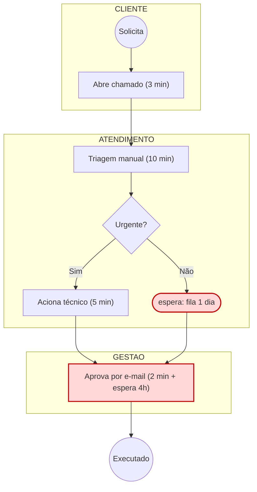

# Notação BPMN e sua tradução para Mermaid

Mermaid é o padrão de entrega desta skill: o `.mmd` abre em excalidraw.com, no VS Code e em qualquer visualizador, e sai em PNG/SVG pela skill vizinha de diagrama. Use BPMN formal apenas se o cliente exigir um `.bpmn` para ferramenta de modelagem.

## Correspondência de elementos

| BPMN | Mermaid (flowchart) | Uso |
| --- | --- | --- |
| Evento de início | `(("Início"))` | Gatilho do processo |
| Evento de fim | `((("Fim")))` | Entrega/encerramento |
| Tarefa | `["Verbo + objeto (tempo)"]` | Trabalho executado |
| Gateway exclusivo (XOR) | `{"Pergunta?"}` | Decisão sim/não, escolha de caminho |
| Gateway paralelo (AND) | `{{"Em paralelo"}}` | Duas ações simultâneas |
| Evento intermediário / espera | `(["espera: 1 dia"])` | Fila, aguardando terceiro |
| Sistema / tarefa de serviço | `[("Sistema: ERP")]` | Ação do sistema |
| Documento | `[/"Contrato.pdf"/]` | Entrada ou saída documental |
| Pool / Lane | `subgraph Ator` | Responsável |
| Fluxo de mensagem | `-.->|e-mail|` | Troca entre atores |
| Loop de retrabalho | `-.->|refaz|` | Devolve para passo anterior |
| Anotação de gargalo | `:::gargalo` | Destaca o ponto crítico |

## Padrão de diagrama com raias

## Boas práticas

- Todo nó começa com **verbo no infinitivo** ou no presente ("Enviar", "Conferir"), com o tempo entre parênteses.
- Um gateway = uma pergunta clara, respondível com sim/não.
- Nomeie o ator no subgraph, não dentro do nó.
- Limite a 15–20 nós por diagrama; acima disso, agrupe em subprocesso (`[["Subprocesso: Aprovação"]]`).
- Marque com a classe `gargalo` todo nó com espera > 30% do lead time ou com retrabalho.
- O diagrama AS-IS deve retratar a realidade (inclusive o "jeitinho"), não o processo ideal. O ideal é o TO-BE.
